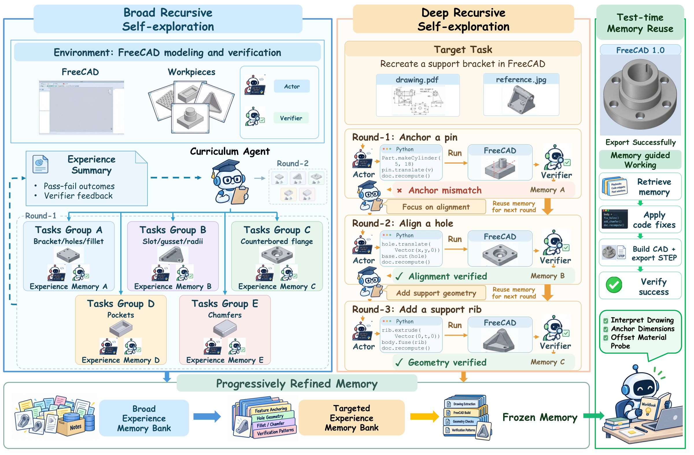

# RSIAgent

**Autonomous Exploration for Recursive Self-improvement in New Environments**

[Paper (Overleaf)](https://www.overleaf.com/project/6a9a6f621edd6601b808861f) · [Method](#method) · [Results](#results) · [Installation](#installation) · [Citation](#citation)

RSIAgent is a **training-free framework for recursive self-improvement** in new
digital environments. It coordinates the Curriculum Agent, Actor Agent, and
Verifier Agent to discover how an environment works, check what they learn against actual execution,
and retain reusable knowledge in persistent memory. Model parameters stay fixed
throughout exploration and downstream task execution.

The paper's central strategy is **broad-then-deep exploration**: first acquire
diverse experience, then investigate hard cases, hidden constraints, and boundary
conditions. The resulting memory contains procedures, scripts, and failure lessons
that the Actor Agent reuses for downstream task execution.

[](docs/assets/framework.png)

*The paper's original framework figure, illustrated with a FreeCAD task. Broad
experience is progressively refined into targeted memory, then frozen for reuse.
Click the figure for full resolution. [Figure provenance](docs/PAPER.md#figure-provenance).*

## Method

Three agents carry out the recursive learning loop:

- **Curriculum Agent** chooses informative exploration tasks using prior outcomes and
  accumulated knowledge, then decides whether further practice is useful.
- **Actor Agent** interacts with software through executable Python or Bash programs
  and visual observations. After verification, the same Actor Agent distills its
  experience and reconciles it with existing memory.
- **Verifier Agent** independently inspects task requirements and the resulting
  environment. Its feedback grounds learning; it cannot read the Actor Agent's
  private reasoning or memory.

The paper has **two exploration stages followed by test-time memory reuse**.
**RSI and test-time execution use the same agent framework**, with fixed model
parameters throughout. At test time, memory is frozen, and the Curriculum Agent
and memory updates are disabled. The implementation exposes these as three
runtime phases:

| Runtime phase | Paper stage | Learning and execution |
| --- | --- | --- |
| **Phase 1** | **Broad Recursive Self-exploration (BRS)** | The Curriculum Agent proposes diverse projects. Actor Agents execute and Verifier Agents check them in parallel from a shared starting memory. After the complete wave, Actor Agents consolidate their experiences in order. |
| **Phase 2** | **Deep Recursive Self-exploration (DRS)** | Target attempts reveal gaps and fragile successes. The Curriculum Agent selects focused practice; each verified experience updates memory before subsequent practice or another target attempt. |
| **Phase 3** | **Test-time memory reuse** | The Actor Agent uses frozen memory to guide task execution, interacting with the Verifier Agent through the same action–verification loop used during RSI. Sealed official evaluation follows task execution and verification. |

Memory is the persistent learning state across tasks. Interaction histories and
task environments are reset between independent attempts; the Agent framework
remains unchanged. Both grounded successes and failures can teach useful lessons.
Official benchmark scores are kept outside the learning loop. See
[Architecture](docs/ARCHITECTURE.md) for the role interfaces, wave memory barrier,
and stopping rules.

## Results

The manuscript reports these **mean partial-credit scores (%)** for the shared
harness coordinating the Actor Agent and Verifier Agent, with and without RSI:

| Benchmark and reporting coverage | RSIAgent w/o RSI | RSIAgent |
| --- | ---: | ---: |
| OSWorld 2.0 · 0808 offline · 82 tasks | 71.97 | **78.98** |
| Agents' Last Exam · Near-term · 67 tasks | 83.75 | **84.82** |

These are the manuscript's reported aggregates. The RSI column uses 41 recorded
RSI entries for OSWorld and 19 for ALE, retaining baseline scores for the other
41 OSWorld tasks and 48 ALE tasks. ALE includes all 67 Near-term tasks, including
the three GPU baseline results. The RSI column includes selected retries and
checkpoints with differing budgets; it is not an average over matched repeated
runs. ALE also includes qualified local
regrades and protocol variants. See the [paper and reporting notes](docs/PAPER.md)
for the full scope, full-credit metrics, and aggregation details.

The paper also examines stage ablations, memory growth, and game development.
Its failure analysis identifies three limits to improvement: practice can miss
the relevant weakness, verification can accept incomplete work, and memory can
preserve an incorrect rule. The quality of exploration, verification, and memory
consolidation therefore matters alongside the amount of practice.

## Benchmarks

| Integration | Pinned release | Public batch |
| --- | --- | --- |
| OSWorld-V2 | August 8, 2026 | 108 tasks, Docker/QEMU |
| Agents' Last Exam (ALE) | `d10fb61a14f9719774c3520c5763068b28ef5546` | 67 Near-term tasks; 64 CPU tasks supported, 3 GPU tasks recorded as pending |

Only the current runtime is included. Both integrations use the same Actor,
Verifier, Curriculum, and memory protocol. Benchmark setup and grading remain
outside the learning process.

## Repository layout

```text
run_osworld.py        OSWorld batch entrypoint
run_ale.py            ALE preparation, execution, and reporting
benchmarks/
  osworld/           OSWorld stages, VM adapter, and evaluation
  ale/               ALE host, worker, and VM adapters
core/                Shared Actor and Verifier runtime
explore/             Curriculum, learning, memory, and recovery
env/                 Shared guest transport and isolation
llm/                 Model clients
config/              Role profiles and benchmark configurations
scripts/             Setup and individual-study helpers
tools/               Preparation, smoke checks, and recovery utilities
tests/               Regression tests
docs/                Architecture and operations
```

The two root entrypoints are the starting point for benchmark runs. Internal
OSWorld stages are Python modules under `benchmarks/osworld/`; see the
[source map](docs/ARCHITECTURE.md#source-map) for their responsibilities.

## Installation

Use Python 3.12 and a Linux host with Docker/KVM. VM images, benchmark assets,
and credentials are obtained separately. Start with the repository and your own
model API credential:

```bash
git clone https://github.com/AetherLabsAI/RSIAgent.git
cd RSIAgent
cp .env.example .env
```

Fill in `OPENROUTER_API_KEY` in `.env`. Paths default to this checkout and sibling
benchmark directories. Export `RSIAGENT_ROOT`, `OSWORLD_ROOT`, or
`RSIAGENT_ENV_FILE` only when using a different layout.

### OSWorld

Install the pinned [OSWorld release](https://github.com/xlang-ai/OSWorld-V2/tree/v2026.08.08)
and follow its [Docker setup](https://github.com/xlang-ai/OSWorld-V2/blob/v2026.08.08/docs/PROVIDER_SETUP.md#docker).
From the RSIAgent checkout:

```bash
git clone --branch v2026.08.08 https://github.com/xlang-ai/OSWorld-V2.git ../OSWorld-V2
cd ../OSWorld-V2
uv sync --frozen
uv pip install --python .venv/bin/python -r ../RSIAgent/requirements.txt
source .venv/bin/activate
cd ../RSIAgent
python tools/prepare_osworld_v2_release.py
python tools/build_p2_corpus.py
python tools/exam_fence.py build
```

The audit files under `results/` are host-only rejection data. They must never
enter an Agent prompt or memory.

### ALE

The setup script clones the pinned upstream source and installs separate grader
and worker environments. This separation prevents the two projects' Python
packages from shadowing each other.

```bash
python3 scripts/setup_ale.py
../agents-last-exam/.venv/bin/python run_ale.py prepare --os linux
../agents-last-exam/.venv/bin/python run_ale.py prepare --os windows
```

Each preparation downloads only the selected OS image. Linux requires about
167 GiB and Windows about 157 GiB, plus download and VM working space. Use
`--cache /path/with/space` consistently for preparation, smoke tests, and runs.
See [ALE operations](docs/ALE.md) for options and the upstream guide.

## Run batches

OSWorld runs the full pinned cohort without personnel assignments or shards:

```bash
python run_osworld.py --arm baseline --name baseline_run
python run_osworld.py --arm rsi --name rsi_run
```

Use `--arm both` for both arms, `--concurrency N` for independent task lineages,
and `--dry-run` to inspect the plan. A task failure stops its remaining phases;
other tasks continue. Logs and status are under `results/batches/<name>/`.
Existing outputs are never overwritten.

ALE's runner is already a batch entrypoint:

```bash
../agents-last-exam/.venv/bin/python run_ale.py run \
  --arm both --output results/ale/run_01
../agents-last-exam/.venv/bin/python run_ale.py report \
  --runs results/ale/run_01 --output results/ale/report_01
```

ALE requires a successful smoke for each requested OS on the current source and
runner image. Its report keeps missing and GPU-pending results explicit and
rejects duplicate scored attempts.

For an individual OSWorld study, edit `config/osworld/rsi.example.json` and run
`bash scripts/run_rsi.sh path/to/protocol.json`. The example preserves an
eight-project Phase 1 boundary, four concurrent practice branches, and
`curriculum_review` in Phase 2. Task-conditioned adaptation and held-out
experiments are distinct study designs; see [operations](docs/OPERATIONS.md).

## Validation

Portable checks run without credentials, Docker, or benchmark installations:

```bash
uv venv .venv --python 3.12
uv pip install --python .venv/bin/python -r requirements-dev.txt
.venv/bin/python tools/check_rsi_release.py
```

Before a desktop run, execute the real VM smoke in the relevant environment:

```bash
python tools/smoke_osworld.py --output results/smoke/osworld
../agents-last-exam/.venv/bin/python run_ale.py smoke --os linux
../agents-last-exam/.venv/bin/python run_ale.py smoke --os windows
```

These checks exercise transport, immutable memory, candidate replay, Verifier
isolation, and checkpoint rollback using synthetic files. They make no model or
official grader calls. They validate runtime mechanics; reproducing benchmark
scores requires complete experiments with the pinned configuration.

## Documentation

- [Architecture](docs/ARCHITECTURE.md)
- [OSWorld operations and recovery](docs/OPERATIONS.md)
- [ALE setup, batches, and reports](docs/ALE.md)
- [Release provenance and validation](docs/RELEASE.md)
- [Paper and reporting scope](docs/PAPER.md)
- [Contributing](CONTRIBUTING.md) · [Third-party attribution](THIRD_PARTY.md)

## Citation

If you use RSIAgent, please cite the manuscript:

```bibtex
@unpublished{zhu2026rsiagent,
  title = {RSIAgent: Autonomous Exploration for Recursive
           Self-improvement in New Environments},
  author = {Zhu, Sibo and Fan, Shicheng and Wang, Xinyue
            and Wu, Wenyi and Zhou, Kun and Huang, Biwei},
  year = {2026},
  note = {Technical report},
  url = {https://www.overleaf.com/project/6a9a6f621edd6601b808861f}
}
```

## License status

A distribution license has not yet been selected for this repository. Third-party dependency licenses are described in [THIRD_PARTY.md](THIRD_PARTY.md).
