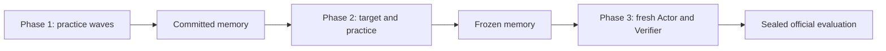

# RSIAgent

RSIAgent is a framework for improving computer-use agents through practice and
durable memory. An Actor performs tasks, an independent Verifier evaluates its
work, and a Curriculum agent chooses the next learning experience. Learning
updates the Actor's memory files; it does not update model weights.

The current integration runs on **OSWorld-V2's August 8, 2026 release**, using
Docker/QEMU guests. It supports three separate stages:

| Stage | What happens | Output |
| --- | --- | --- |
| Phase 1: exploration | Curriculum authors practice waves; Actors work from the same starting memory; verified experiences are distilled in order. | General or target-conditioned memory |
| Phase 2: adaptation | The Actor attempts a development target, learns from verified outcomes, and follows Curriculum-selected practice. | Adapted memory |
| Phase 3: evaluation | A fresh Actor solves the task with a frozen memory snapshot, then the sealed official evaluator runs. | Official score and provenance |



## Installation

Use Python 3.12 and a Linux host with Docker and accessible `/dev/kvm` for desktop
runs. Model API access, the OSWorld guest image, and access to its gated task and
asset datasets are required. This repository contains source, configuration, and
tests; it does not contain credentials, benchmark assets, VM images, or research
trajectories. Install and run it from a source checkout.

```bash
git clone https://github.com/AetherLabsAI/RSIAgent.git
git clone --branch v2026.08.08 https://github.com/xlang-ai/OSWorld-V2.git
```

Follow the pinned OSWorld [installation instructions](https://github.com/xlang-ai/OSWorld-V2/tree/v2026.08.08)
and [Docker provider setup](https://github.com/xlang-ai/OSWorld-V2/blob/v2026.08.08/docs/PROVIDER_SETUP.md#docker).
With `uv` installed, create its environment and add RSIAgent's dependencies:

```bash
cd OSWorld-V2
uv sync --frozen
uv pip install --python .venv/bin/python -r ../RSIAgent/requirements.txt
source .venv/bin/activate
cd ../RSIAgent

export FORGE_ROOT="$PWD"
export OSWORLD_ROOT="$(dirname "$FORGE_ROOT")/OSWorld-V2"
cp .env.example .env
```

Fill in your own `OPENROUTER_API_KEY` in `.env`. `FORGE_*` names are retained for
compatibility with existing configurations. Hugging Face access and any website
credentials are configured separately using OSWorld's instructions.

Prepare the pinned task release and the host-only rejection checks:

```bash
python tools/prepare_osworld_v2_release.py --osworld-root "$OSWORLD_ROOT"
python tools/build_p2_corpus.py
python tools/exam_fence.py build
```

The two audit tools create reject-only data under the ignored `results/`
directory. These files must stay on the host and must never enter an Agent prompt
or learning memory.

## Run a study

Copy the supplied target-conditioned example and give the study a unique name:

```bash
mkdir -p results/protocols
cp config/recursive_self_improvement_0808.example.json results/protocols/my_study.json
```

Edit `run_name`, the public task/query file, and both task lists before launching.
The example uses T080, an eight-project Phase 1 boundary, up to four concurrent
practice branches, and `curriculum_review` in Phase 2. In a target-conditioned
study, development and evaluation name the same task, using fresh environments.
For unseen-task research, use `held_out_generalization` and disjoint task sets.

Inspect the configuration, then run all three stages in sequence:

```bash
python run_recursive_improvement.py \
  --protocol results/protocols/my_study.json --phase phase1 --preflight

bash scripts/run_rsi.sh results/protocols/my_study.json
```

The wrapper uses a separate cache for each stage, streams output, and stops on a
failed command. It does not restart failed attempts. To invoke a stage directly:

```bash
python run_recursive_improvement.py \
  --protocol results/protocols/my_study.json --phase phase1 \
  --execute RUN-RECURSIVE-IMPROVEMENT-PHASE1
```

Use `phase2`/`PHASE2` and `phase3`/`PHASE3` for later stages. Results, protocol
locks, and memory snapshots are saved under
`results/recursive_improvement/<run_name>/`; detailed task runs have their own
paths referenced by the phase results. See [operation and recovery](docs/OPERATIONS.md).

## Defaults and boundaries

- The Actor owns memory updates after valid Verifier PASS and FAIL outcomes.
  An infrastructure failure or `UNVERIFIED` outcome is not a learning verdict.
- A Phase 1 wave is a memory barrier: sibling Actors see the same frozen memory,
  and all branch verdicts precede serial memory commits. The eight-project budget
  is checked after complete waves and can be exceeded by the final wave.
- Phase 2 defaults to `curriculum_review`: a target PASS is learned, then
  Curriculum reviews whether to continue. `READY_FOR_TARGET` after practice
  requests another target attempt. It does not bypass target verification.
  `verifier_pass` is an explicit alternative stopping policy.
- Curriculum's direct Phase 2 memory access defaults to `read_only`. The direct
  Phase 2 runner also exposes `--phase2-curriculum-memory-access none` for separate
  comparison lineages. This disables Curriculum's direct access, not the Actor's.
- The default Phase 2 lifecycle has no two-project cap. The recent capped
  ablations used separate experiment controls, which are not a public runner API.
- Official evaluation is unavailable during learning. Phase 3 uses frozen memory
  with no host writeback and no evaluation feedback into learning.

The supplied role profiles use GLM-5.3 for the Actor and Kimi K3 for Curriculum and
verification. The target Actor watchdog is ten hours per Actor run; this is not a
ten-hour limit on the whole study. Configuration hashes and evaluator release
bindings are checked before evaluation. Change profiles in a new, explicitly
recorded protocol rather than editing a running study's locked configuration.

## Tests

The portable suite runs without model credentials, Docker, or a benchmark checkout:

```bash
python3.12 -m venv .venv
source .venv/bin/activate
python -m pip install -r requirements-dev.txt
python tools/check_rsi_release.py
```

Tests cover role boundaries, memory commits, stopping policies, recovery admission,
transport handling, configuration locks, and sealed evaluation. They do not replace
a live VM smoke test on a newly provisioned machine.

Two optional tests exercise the T102 correction against the frozen external
evaluator. In a fully prepared OSWorld Python environment, run them with
`RSI_TEST_OSWORLD_INTEGRATION=1 python -m pytest -q tests/test_evaluator_corrections.py`.

## Documentation

- [Architecture and learning protocol](docs/ARCHITECTURE.md)
- [Operation, configuration, and recovery](docs/OPERATIONS.md)
- [Release provenance](docs/RELEASE.md)
- [Contributing](CONTRIBUTING.md)
- [Dependency and benchmark attribution](THIRD_PARTY.md)

RSI is an experimental method. Memory can improve or regress performance; report
all planned outcomes and repeated evaluation draws. A target-conditioned result
does not establish generalization to an unseen task.

## License status

A distribution license has not yet been selected for this initial company-review
package. Third-party dependency licenses are described in [THIRD_PARTY.md](THIRD_PARTY.md).
